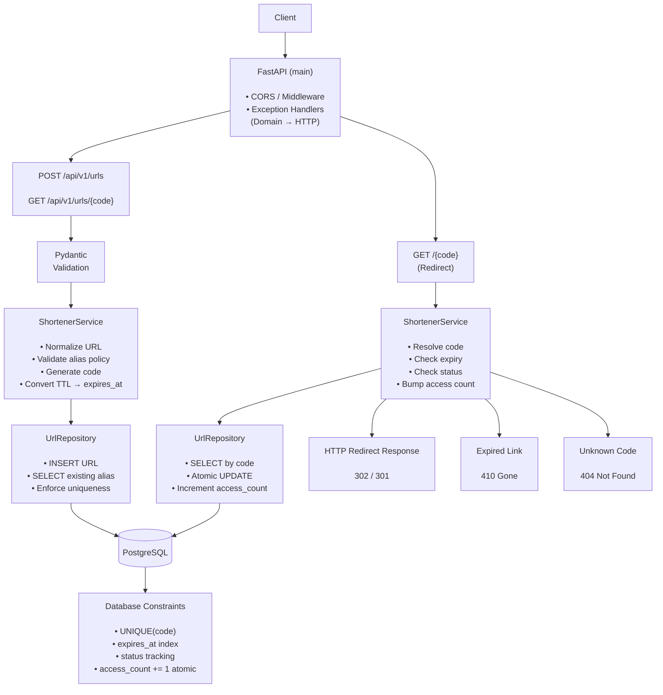

```mermaid
flowchart TD
    CLIENT[Client]

    FASTAPI["FastAPI (main)<br/><br/>• CORS / Middleware<br/>• Exception Handlers<br/>(Domain → HTTP)"]

    CLIENT --> FASTAPI

    FASTAPI --> CREATE["POST /api/v1/urls<br/><br/>GET /api/v1/urls/{code}"]
    FASTAPI --> REDIRECT["GET /{code}<br/>(Redirect)"]

    CREATE --> VALIDATION["Pydantic<br/>Validation"]

    VALIDATION --> CREATE_SERVICE["ShortenerService<br/><br/>• Normalize URL<br/>• Validate alias policy<br/>• Generate code<br/>• Convert TTL → expires_at"]

    REDIRECT --> REDIRECT_SERVICE["ShortenerService<br/><br/>• Resolve code<br/>• Check expiry<br/>• Check status<br/>• Bump access count"]

    CREATE_SERVICE --> CREATE_REPO["UrlRepository<br/><br/>• INSERT URL<br/>• SELECT existing alias<br/>• Enforce uniqueness"]

    REDIRECT_SERVICE --> REDIRECT_REPO["UrlRepository<br/><br/>• SELECT by code<br/>• Atomic UPDATE<br/>• Increment access_count"]

    CREATE_REPO --> DB[(PostgreSQL)]

    REDIRECT_REPO --> DB

    DB --> DB_RULES["Database Constraints<br/><br/>• UNIQUE(code)<br/>• expires_at index<br/>• status tracking<br/>• access_count += 1 atomic"]

    REDIRECT_SERVICE --> RESPONSE["HTTP Redirect Response<br/><br/>302 / 301"]

    REDIRECT_SERVICE --> EXPIRED["Expired Link<br/><br/>410 Gone"]

    REDIRECT_SERVICE --> NOT_FOUND["Unknown Code<br/><br/>404 Not Found"]
```
