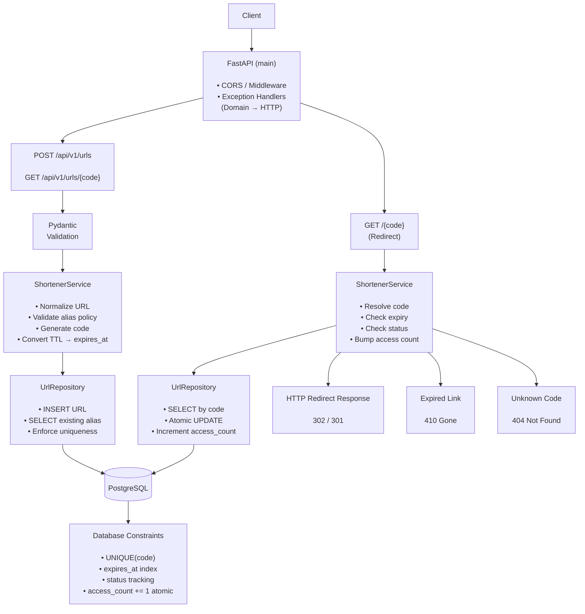

# URL Shortener API

FastAPI service that creates short links, redirects with Redis caching, tracks access counts, supports optional expiry and custom aliases, and deduplicates create retries via `Idempotency-Key`.

## Features

- `POST /api/v1/urls` — shorten a URL (optional `custom_alias`, `expires_in_seconds`, `Idempotency-Key`)
- `GET /{code}` — redirect to the original URL (`302`)
- `GET /api/v1/urls/{code}` — metadata (creation time, access count, expiry)
- Unknown codes → `404`; expired codes → `410`
- Custom alias collisions → `409` (DB unique constraint; safe under concurrent requests)
- Redis cache for hot redirects; atomic `access_count` increments in PostgreSQL

## Project layout

```text
app/
  api/          # HTTP routes and dependencies
  core/         # domain errors
  db/           # engine / session
  models/       # SQLAlchemy models
  repositories/ # DB access
  schemas/      # Pydantic request/response
  services/     # shortener, cache, idempotency, alias
alembic/        # migrations
tests/
  unit/
  integration/
.github/workflows/
.do/app.yaml    # DigitalOcean App Platform spec
```

## Prerequisites

- Python 3.11+
- Docker / Docker Compose (recommended)
- PostgreSQL 16 and Redis 7 (via Compose or local installs)

## Quick start (Docker Compose)

```bash
cp .env.example .env
docker compose up --build
```

API: http://localhost:8000  
Docs: http://localhost:8000/docs  
Health: http://localhost:8000/health

## Local development (without Compose for the app)

```bash
# start dependencies
docker compose up -d db redis

python -m venv .venv
source .venv/bin/activate
pip install -r requirements.txt
cp .env.example .env

alembic upgrade head
uvicorn app.main:app --reload --host 0.0.0.0 --port 8000
```

## API examples

### Create a short URL

```bash
curl -s -X POST http://localhost:8000/api/v1/urls \
  -H 'Content-Type: application/json' \
  -d '{"url":"https://example.com/very/long/path"}'
```

### Create with custom alias, TTL, and idempotency key

```bash
curl -s -X POST http://localhost:8000/api/v1/urls \
  -H 'Content-Type: application/json' \
  -H 'Idempotency-Key: 550e8400-e29b-41d4-a716-446655440000' \
  -d '{
    "url":"https://example.com/launch",
    "custom_alias":"launch",
    "expires_in_seconds":86400
  }'
```

Replaying the same key + body returns `200` with the original result.  
Same key + different body returns `409`.

### Redirect

```bash
curl -I http://localhost:8000/launch
```

### Metadata

```bash
curl -s http://localhost:8000/api/v1/urls/launch
```

## Testing

```bash
pip install -r requirements.txt
pytest -q
```

Unit tests mock collaborators. Integration tests use in-memory SQLite and `fakeredis` (no Docker required for the test suite). CI still runs against real Postgres + Redis service containers.

## Configuration

| Variable | Description | Default |
|----------|-------------|---------|
| `DATABASE_URL` | SQLAlchemy DB URL | Postgres local URL |
| `REDIS_URL` | Redis URL | `redis://localhost:6379/0` |
| `BASE_URL` | Public base used in `short_url` | `http://localhost:8000` |
| `SHORT_CODE_LENGTH` | Auto-generated code length | `7` |
| `CACHE_TTL_SECONDS` | Redirect cache TTL (capped by expiry) | `300` |
| `IDEMPOTENCY_TTL_SECONDS` | Idempotency record TTL | `86400` |

## CI/CD (GitHub Actions → DigitalOcean)

- `.github/workflows/ci.yml` — lint, migrate, pytest (Postgres + Redis services), Docker build
- `.github/workflows/deploy.yml` — build/push to DO Container Registry and trigger App Platform deployment
- `.do/app.yaml` — App Platform service definition

### One-time DigitalOcean setup

1. Create a Container Registry and managed Postgres + Redis (or Redis-compatible) databases.
2. Build/push an initial image, or let the deploy workflow do it after secrets are set.
3. Create the app: `doctl apps create --spec .do/app.yaml` (set `DATABASE_URL`, `REDIS_URL`, `BASE_URL`).
4. In the GitHub repo, add secrets:
   - `DIGITALOCEAN_ACCESS_TOKEN`
   - `DO_REGISTRY_NAME` (registry name, not full host)
   - `DO_APP_ID`

Pushes to `main`/`master` run CI; deploy workflow publishes the image and creates a new App Platform deployment.

## Error reference

| Status | Meaning |
|--------|---------|
| `400` / `422` | Invalid input |
| `404` | Unknown short code |
| `409` | Alias taken, or idempotency key reused with different body |
| `410` | Short URL expired |



